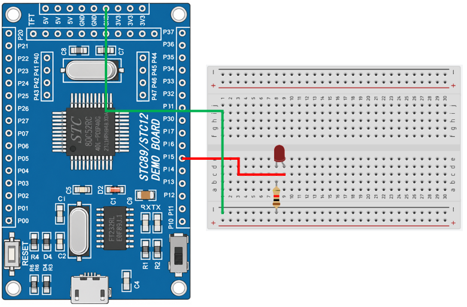

# 8051 Project - LED Blink

這是一個基於 STC89C52RC（8051）微控制器的示例專案，展示如何控制 LED 閃爍。

## 硬體要求

* STC89C52RC 微控制器
* LED x1
* 220Ω 電阻 x1

## 軟體依賴

* VSCode
* EIDE
* Keil C51 Toolchain

## 電路圖

## 構建和編譯

1. 使用 VSCode 開啟專案資料夾
2. 確認 EIDE 已設定 Keil C51 Toolchain
3. 執行 Build
4. 產生 HEX 檔
5. 使用 stcflash 燒錄至微控制器

## 使用方法

將程式燒錄至 STC89C52RC 後，LED 將每隔 0.5 秒切換一次狀態（亮／滅），並持續循環閃爍。

