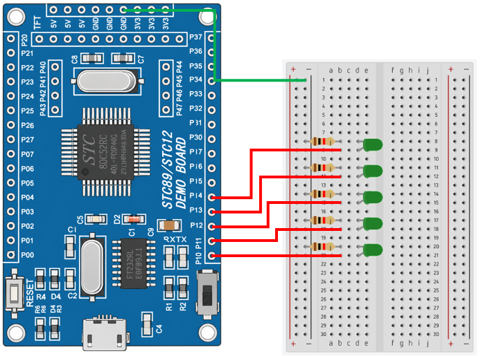

# 8051 Project - LED Running Light

這是一個基於 STC89C52RC（8051）微控制器的示例專案，展示如何控制 LED 依序點亮形成流水燈效果。

## 硬體要求

* STC89C52RC 微控制器 x1
* LED x5
* 220Ω 電阻 x5

## 軟體依賴

* VSCode
* EIDE
* Keil C51 Toolchain

## 電路圖

## 構建和編譯

1. 使用 VSCode 開啟專案資料夾
2. 確認 EIDE 已設定 Keil C51 Toolchain
3. 執行 Build
4. 產生 HEX 檔
5. 使用 stcflash 燒錄至微控制器

## 使用方法

將程式燒錄至 STC89C52RC 後，LED 將依序點亮，形成流水燈效果。每隔固定時間切換至下一顆 LED，抵達最後一顆後自動回到第一顆，持續循環。

