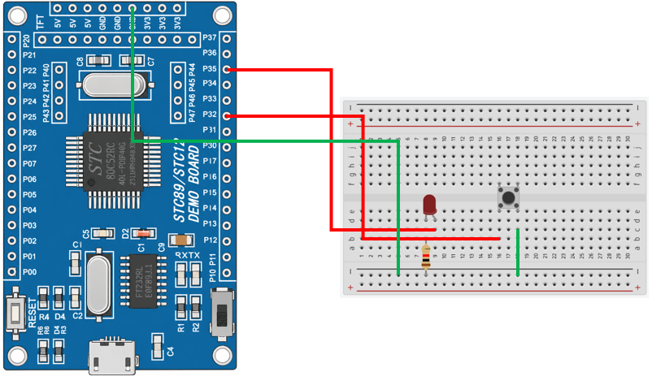

# 8051 Project - Button Toggle LED

這是一個基於 STC89C52RC（8051）微控制器的示例專案，展示如何使用按鍵控制 LED 狀態切換。

## 硬體要求

* STC89C52RC 微控制器
* LED × 1
* 按鍵 × 1
* 220Ω 電阻（LED 限流）

## 軟體依賴

* VSCode
* EIDE
* Keil C51 Toolchain

## 電路圖

## 構建和編譯

1. 使用 VSCode 開啟專案資料夾
2. 確認 EIDE 已設定 Keil C51 Toolchain
3. 執行 Build
4. 產生 HEX 檔
5. 使用 stcflash 燒錄至微控制器

## 使用方法

將程式燒錄至 STC89C52 後：

* 第一次按下按鍵，LED 點亮
* 第二次按下按鍵，LED 熄滅
* 之後每按一次按鍵，LED 狀態切換一次

## 功能介紹

* 按鍵防抖

    按鍵按下後延遲約 10 ms，再次確認按鍵狀態，以避免機械接點震盪造成誤判。

* LED 狀態切換

    利用 Toggle 邏輯控制 LED 狀態：

    - LED 熄滅 → 按下按鍵 → LED 點亮
    - LED 點亮 → 按下按鍵 → LED 熄滅
