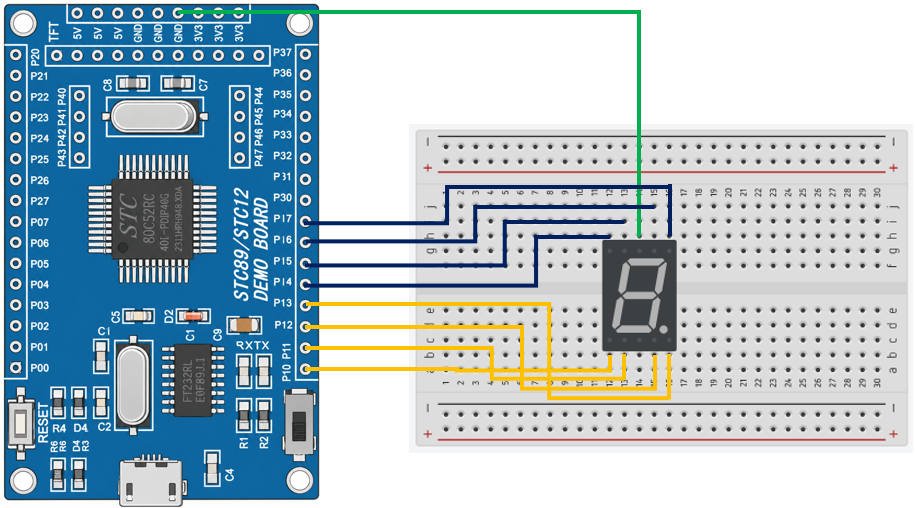

# 8051 Project - Seven Segment Display

這是一個基於 STC89C52RC（8051）微控制器的示例專案，展示如何控制單位數七段顯示器顯示數字 0 ~ 9。

## 硬體要求

* STC89C52RC 微控制器
* 一位數七段顯示器（共陰極）

## 軟體依賴

* VSCode
* EIDE
* Keil C51 Toolchain

## 電路圖

## 構建和編譯

1. 使用 VSCode 開啟專案資料夾
2. 確認 EIDE 已設定 Keil C51 Toolchain
3. 執行 Build
4. 產生 HEX 檔
5. 使用 stcflash 燒錄至微控制器

## 使用方法

將程式燒錄至 STC89C52RC 後，七段顯示器將每隔 1 秒依序顯示 0 ~ 9，並循環重複。

## 功能介紹

* 七段顯示器控制

    使用 GPIO 控制七段顯示器顯示數字。

* 數字顯示

    利用段碼對應數字 0 ~ 9 進行顯示。
