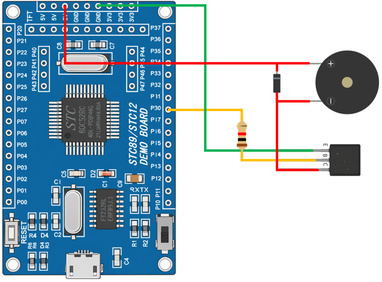

# 8051 Project - Buzzer Melody Player

這是一個基於 STC89C52RC（8051）微控制器的示例專案，展示如何使用無源蜂鳴器播放簡單旋律。
以《小星星》為範例，透過產生不同頻率的方波來演奏音樂。

## 硬體要求

* STC89C52RC 微控制器 x1
* 無源蜂鳴器 x1
* 二極體 x1
* 10kΩ 電阻 x1
* NPN 型 BJT x1

## 軟體依賴

* VSCode
* EIDE
* Keil C51 Toolchain

## 電路圖

## 構建和編譯

1. 使用 VSCode 開啟專案資料夾
2. 確認 EIDE 已設定 Keil C51 Toolchain
3. 執行 Build
4. 產生 HEX 檔
5. 使用 stcflash 燒錄至微控制器

## 使用方法

將程式燒錄至 STC89C52RC 後，蜂鳴器將自動播放《小星星》旋律，播放完畢後暫停一段時間，並循環重複播放。

## 功能介紹

* 蜂鳴器控制

  使用 GPIO 輸出方波訊號驅動無源蜂鳴器發聲。

* 音階產生

  透過設定不同頻率產生 Do、Re、Mi、Fa、So、La、Si 等音階。

