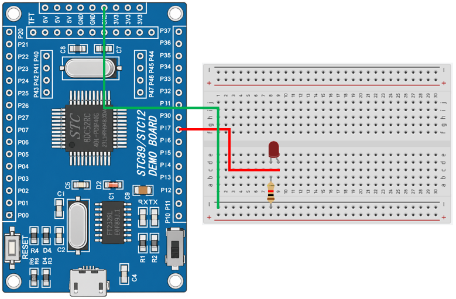

# 8051 Project - LED Blink 2

這是一個基於 STC89C52RC（8051）微控制器的示例專案，展示如何使用計時器中斷產生固定週期，並控制 LED 週期性亮滅。

## 硬體要求

* STC89C52RC 微控制器 x1
* 220Ω 電阻 ×1
* LED x1

## 軟體依賴

* VSCode
* EIDE
* Keil C51 Toolchain

## 電路圖

## 構建和編譯

1. 使用 VSCode 開啟專案資料夾
2. 確認 EIDE 已設定 Keil C51 Toolchain
3. 執行 Build
4. 產生 HEX 檔
5. 使用 stcflash 燒錄至微控制器

## 使用方法

將程式燒錄至 STC89C52RC 後， LED 將以 1 秒亮、1 秒滅 的方式持續閃爍。

## 功能介紹

* Timer0 計時器中斷

  Timer0 設定為 16 位元定時器，每 1 ms 產生一次中斷

* 計時器中斷處理函式

  Timer0 溢位後進入中斷處理函式，重新載入計數器初始值，並依序呼叫所有已註冊的回呼函式

* 回呼函式

  提供回呼函式註冊機制，可讓應用程式將需要週期性執行的工作註冊至 Timer0，由驅動程式統一於每次中斷時呼叫

* LED 控制

  回呼函式累計 1000 次 Timer0 中斷後切換 LED 的輸出狀態，使 LED 每隔 1 秒 亮滅一次
